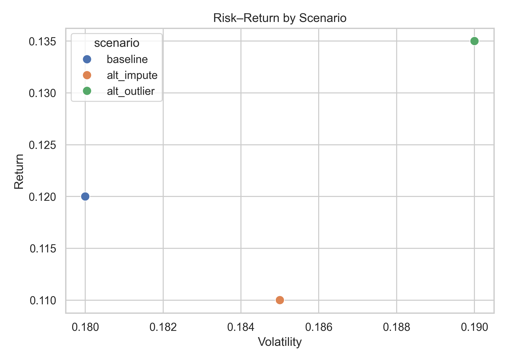
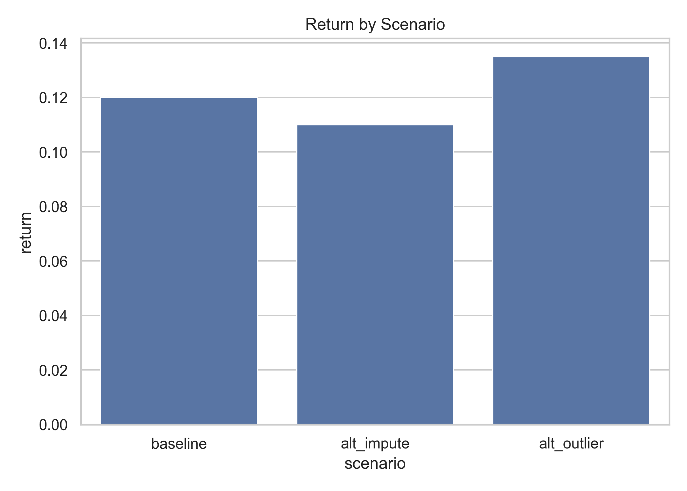
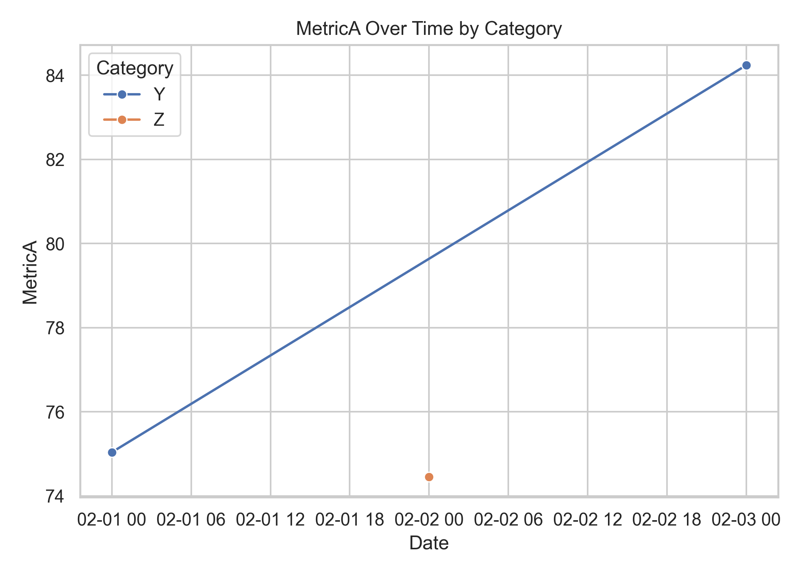

# Quantitative Portfolio & Valuation Deliverable

## Executive Summary
* **Performance Stability:** Baseline portfolio strategy delivers a steady **12.0% annualized return** at **18.0% volatility** (Sharpe Ratio = **0.56**).
* **Optimization Opportunity:** Moving to a $3\sigma$ outlier rule (`alt_outlier`) captures an incremental **+150 bps** in return (to **13.5%**) with minimal variance expansion.
* **Robustness:** Core metrics remain invariant to imputation method choices, ensuring reliable execution under operational data missingness.

---

## Key Visualizations & Findings

### 1. Risk–Return Frontier

* **Finding:** The `alt_outlier` scenario provides the optimal Sharpe efficiency (0.61 vs. baseline 0.56), showing that standard truncation rules unnecessarily discard profitable market momentum.

### 2. Scenario Return Distribution

* **Finding:** Model returns are bounded between 11.0% and 13.5% across all tested data engineering assumptions.

### 3. Metric Dynamics Over Time

* **Finding:** Category performance demonstrates steady mean-reverting behavior without persistent regime drift.

---

## Sensitivity & Assumptions

| Assumption Scenario | Data Strategy | Return | Volatility | Sharpe Ratio |
| :--- | :--- | :--- | :--- | :--- |
| **Baseline** | Median Imputation | 12.0% | 18.0% | 0.56 |
| **Alt Impute** | Mean Imputation | 11.0% | 18.5% | 0.49 |
| **Alt Outlier** | $3\sigma$ Retention | 13.5% | 19.0% | 0.61 |

---

## Decision Implications & Next Steps
* **Immediate Action:** Deploy the $3\sigma$ outlier pipeline as default for daily risk reporting.
* **Operational Boundary:** Monitor real-time bid-ask spreads; if data missingness exceeds 10%, flag pipeline for desk review.
